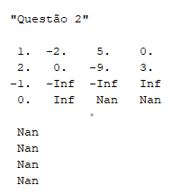
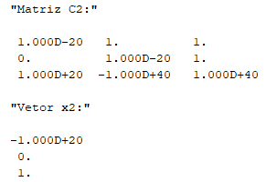
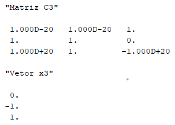
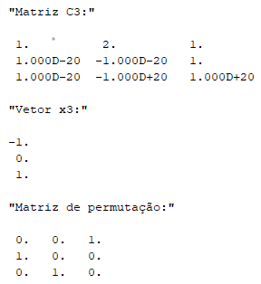
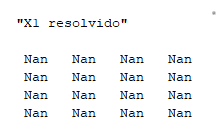
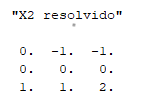

# ALN - Aula Prática 1
Autor: Daniel de Miranda Almeida

Matrícula: 241708065, Curso: Ciência de Dados

### Questões 1 e 2

Como o código para essas questões já foi passado, vou me ater somente às matrizes passadas para a função e o resultado gerado.


Nesses dois primeiros prompts temos, em ordem, a matriz de exemplo, o vetor de exemplo, a matriz e o vetor após a eliminação gaussiana. Uma coisa que conseguimos perceber é que a matriz C retornada pela função é composta pelas matriz L e U "conjugadas" em uma matriz só. Se pegarmos os números da diagonal pra baixo temos a matriz L, e da diagonal para cima (com a diagonal inclusa) temos a matriz U.



Nesse prompt, com a matriz e o vetor retornados pela função ```Gaussian_Elimination_1``` relativo à operação de eliminação gaussiana da questão 2, podemos ver que, como após a eliminação dos elementos na primeira coluna o segundo pivô se torna 0, quando a função tenta fazer a divisão dos elementos que serão eliminados pelo pivô, acabamos tendo como resultado um infinito; e, como os valores da terceira linha a partir da segunda coluna ficaram infinitos, os últimos dois valores da matriz se tornaram NaN, provavelmente por algum problema do scilab na hora de computá-los.

### Questão 3

```scilab
function [x, C]=Gaussian_Elimination_2(A, b)
    C=[A,b];
    [n]=size(C,1);
    
    for j=1:(n-1)
        // se o nosso pivo for 0
        if C(j, j) == 0 then
            // encontramos na mesma coluna, na linha a partir do pivo o primeiro elemento não nulo 
            non_zero_index = find(C(j:n, j), 1);
            // e trocamos as linhas da matriz. a expressão non_zero_index + j - 1 é porque o índice do find é relativo ao vetor que é passado para ele, não à matriz em si, então é necessário fazer um ajuste.
            C([non_zero_index + j - 1, j], :) = C([j, non_zero_index + j - 1], :);
        end

        for i=(j+1):n
            C(i,j)=C(i,j)/C(j,j);
            C(i,j+1:n+1)=C(i,j+1:n+1)-C(i,j)*C(j,j+1:n+1);
        end
    end
    
    x=zeros(n,1);
    // Calcula x, sendo Ux=C(1:n,n+1)
    x(n)=C(n,n+1)/C(n,n);
    
    for i=n-1:-1:1
        x(i)=(C(i,n+1)-C(i,i+1:n)*x(i+1:n))/C(i,i);
    end
    
    C=C(1:n,1:n);
endfunction
```

Nessa função, a única diferença está nos loops for que executam a eliminação. Aqui, quando encontramos um pivo igual a 0, procuramos pelo índice do primeiro elemento na mesma coluna que seja diferente de 0 e o usamos para executar a troca de linhas. Como a função find retorna um índice que se baseia na posição dos elementos a partir de onde foi chamada, é necessário ajustar com um -1 o índice quando fazemos a troca de linhas. Retorno da questão 3:



### Questão 4

```scilab
function [x, C]=Gaussian_Elimination_3(A, b)
    C=[A,b];
    [n]=size(C,1);
    
    for j=1:(n-1)
        // se o nosso pivo for 0
        if C(j, j) == 0 then
            // encontramos na mesma coluna, na linha a partir do pivo o maior elemento, salvando o seu índice 
            [max_value, max_index] = max(abs(C(j:n,:)));
            C([max_index + j - 1, j], :) = C([j, max_index + j - 1], :);
        end

        for i=(j+1):n
            C(i,j)=C(i,j)/C(j,j);
            C(i,j+1:n+1)=C(i,j+1:n+1)-C(i,j)*C(j,j+1:n+1);
        end
    end
    
    x=zeros(n,1);
    // Calcula x, sendo Ux=C(1:n,n+1)
    x(n)=C(n,n+1)/C(n,n);
    
    for i=n-1:-1:1
        x(i)=(C(i,n+1)-C(i,i+1:n)*x(i+1:n))/C(i,i);
    end
    
    C=C(1:n,1:n);
endfunction
```

A diferença dessa função para questão anterior está no fato de que agora usamos a função ```max``` junto da função ```abs```. A primeira localiza o maior elemento de um vetor ou matriz e retorna seu índice, enquanto a segunda transforma todos os números em seu valor absoluto, de forma que, com as duas, encontramos o maior valor em módulo para o pivô. Após encontrarmos o índice desse novo pivô, a lógica da função permanece a mesma. Retorno da questão 4:



### Questão 5

```scilab
// função que cria uma matriz de permutação permutando uma matriz identidade com as linhas dadas nos parâmetros
function [P] = Create_Permutation(size_m, line_1, line_2)
    //create identity matrix
    I = eye(size_m, size_m)
    // permutate its lines
    I([line_1, line_2], :) = I([line_2, line_1], :)
    P = I
endfunction

function [x, C, P]=Gaussian_Elimination_4(A, b)
    C=[A,b];
    [n]=size(C,1);
    
    // matriz identidade que vai "armazenar" todas as matrizes de permutação usadas ao longo da função
    P = eye(n, n)

    for j=1:(n-1)
        // agora pegamos apenas o pivo com maior valor absoluto e usamos ele para criar a matrix de permutação e aplicá-la na nossa matriz C
        [max_value, max_index] = max(abs(C(j:n,:)));
        [Perm] = Create_Permutation(n, j, max_index)

        // multiplicando C e a identidade pela matriz de permutação
        C = Perm * C
        P = Perm * P
        for i=(j+1):n
            C(i,j)=C(i,j)/C(j,j);
            C(i,j+1:n+1)=C(i,j+1:n+1)-C(i,j)*C(j,j+1:n+1);
        end
    end
    
    x=zeros(n,1);
    // Calcula x, sendo Ux=C(1:n,n+1)
    x(n)=C(n,n+1)/C(n,n);
    
    for i=n-1:-1:1
        x(i)=(C(i,n+1)-C(i,i+1:n)*x(i+1:n))/C(i,i);
    end
    
    C=C(1:n,1:n);
endfunction
```

Nessa questão, eu criei a função auxiliar ```Create_Permutation``` que recebe o tamanho da matriz que será permutada e quais linhas serão permutadas e retorna a matriz de permutação equivalente. Na função ```Gaussian_Elimination_4``` essa função é chamada sempre e a matriz de permutação resultante multiplica tanto a matriz C quanto a matriz P - uma matriz identidade criada para armazenar todas as permutações feitas. Retorno da questão 5:



### Questão 6

```scilab
function [P] = Create_Permutation(size_m, line_1, line_2)
    //create identity matrix
    I = eye(size_m, size_m)
    // permutate its lines
    I([line_1, line_2], :) = I([line_2, line_1], :)
    P = I
endfunction

function [C, P]=Gaussian_Elimination_4(A, b)
    C=[A,b];
    [n]=size(C,1);
    
    // matriz identidade que vai "armazenar" todas as matrizes de permutação usadas ao longo da função
    P = eye(n, n)

    for j=1:(n-1)
        // agora pegamos apenas o pivo com maior valor absoluto e usamos ele para criar a matrix de permutação e aplicá-la na nossa matriz C
        [max_value, max_index] = max(abs(C(j:n,:)));
        [Perm] = Create_Permutation(n, j, max_index)

        // multiplicando C e a identidade pela matriz de permutação
        C = Perm * C
        P = Perm * P
        for i=(j+1):n
            C(i,j)=C(i,j)/C(j,j);
            C(i,j+1:n+1)=C(i,j+1:n+1)-C(i,j)*C(j,j+1:n+1);
        end
    end
    
    C=C(1:n,1:n);
endfunction

function [X]=Resolve_com_LU(C, B, P)
    [n] = size(B, 1)
    [m] = size(B, 2)
    L = tril(C, -1) + eye(n,n)
    U = triu(C)
    B = P * B

    //calcula y sendo y = Ux e Ly = b
    Y=zeros(B);
    Y(1,:)=B(1,:)

    for i=2:n
        Y(i,:)=(B(i,:)-L(i,1:(i-1))*Y(1:(i-1),:));
    end

    //calcula x sendo Ux = y
    X=zeros(Y);
    X(n,:)=Y(n,:)/U(n,n);
    
    for i=n-1:-1:1
        X(i,:)=(Y(i,:)-U(i,i+1:m)*X(i+1:n,:))/U(i,i);
    end
endfunction

A1 = [1 -2 5 0;
      2 -4 1 3; 
      -1 1 0 2; 
      0 3 3 1]
B1 = [2 4 -1 5;
      0 1 0 3;
      2 2 -1 1;
      0 1 1 5]
      
[C1, P1] = Gaussian_Elimination_4(A1, B1(:,1))
[X] = Resolve_com_LU(C1, B1, P1)

disp(X)

A2 = [0, 10^(-20), 1;
       10^(-20), 1, 1;
       1, 2, 1]
       
B2 = [1 1 2;
      1 -1 0;
      1 0 1]
      
[C2, P2] = Gaussian_Elimination_4(A2, B2(:,1))
[X] = Resolve_com_LU(C2, B2, P2)

disp("X e A2 * X")
disp(X)
disp(A2 * X)
```
Nessa função eu reutilizo o código da ```Gaussian_Elimination_4```, retirando apenas a parte que resolve Ux = y, já que a função que deve resolver o sistema é outra. A função ```Resolve_com_LU``` resolve primeiro LY = B "de cima para baixo" e depois UX = Y de "baixo para cima", como faríamos normalmente com álgebra linear. Cada um desses dois processos é feito com uma vetorização dentro de um for, onde fazemos a operação de resolução avançando pelas linhas (tanto para baixo quanto para cima) utilizando simultaneamente todas as colunas de Y e B e depois de X e Y. Retornos da questão 6:





Ademais, gostaria de deixar claro que por algum motivo meu código não está funcionando para resolver completamente a matriz. Realizando um teste na resolução de LY = B percebi que quando multiplico de volta L * Y para adquirir B e verificar se Y está correta a última linha de B fica incorreta. Prints que mostram isso:


Comparei meu código dessa função com o de meus colegas e não consegui perceber onde estou errando. Gostaria de receber um feedback do que pode estar acontecendo de errado nessa função.