# ALN - Aula Prática 2
Autor: Daniel de Miranda Almeida

Matrícula: 241708065, Curso: Ciência de Dados

## Questôes 1 e 2

Função que implementa o método iterativo de Jacobi:

```scilab
// Função do método iterativo de jacobi para aproximar x em Ax = b.
function [sol, final_it, k, norm_res] = Jacobi_Method(A, b, x_0, E, M, norm_type)
    [n]=size(A,1)

    L = tril(A, -1)
    U = triu(A, 1)
    
    D = zeros(n, n)
    
    elementos_diagonal = diag(A)

    for i=1:n
        D(i,i) = elementos_diagonal(i)
    end

    k=0
    D_inv = inv(D)
    M_j = (-D_inv)*(L+U)
    c_j = D_inv*b
    x_k = x_0

    while k < M
        k = k + 1
        x_k1 = M_j*x_k + c_j
        final_it = norm((x_k1 - x_k), norm_type)
        x_k = x_k1

        // Parando o algoritmo quando a tolerância é passada
        if final_it < E then
            disp("Passou a tolerância")
            break
        end
        
        // Parando o algorítmo quando o número máximo de iterações
        // é ultrapassado
        if k == M then
            disp("Ultrapassou o número máximo de iterações")
        end
    end

    sol = x_k1

    res = norm((b - A*x_k1), norm_type)
    norm_res = norm(res, norm_type)

endfunction

A = [3, -2, 1;
     1, 3, 2;
     -1, 2, 4]

initial_vector = [1; 1; 1]
max_iterations = 20
tolerance = 0.01
b = [1; 1; 1]

// com a norma máximo
disp("Norma máximo")
norm_type = %inf // norma máximo
[x, final_it, num_it, norm_res] = Jacobi_Method(A, b, initial_vector, tolerance, max_iterations, norm_type)

disp("x final")
disp(x)

disp("Norma da ultima iteração")
disp(final_it)

disp("Número de iterações")
disp(num_it)

disp("Norma do resíduo")
disp(norm_res)
```

Resultado do método iterativo de Jacobi:

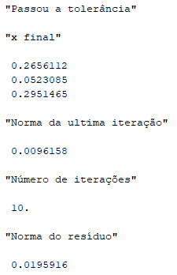

## 

Função que implementa o método iterativo de Gauss-Seidel usando a função inversa:

```scilab
function [sol, final_it, k, norm_res] = GS_Method(A, b, x_0, E, M, norm_type)
    [n]=size(A,1)

    // Criando matrizes L,D e U.
    L = tril(A, -1)
    U = triu(A, 1)
    
    D = zeros(n, n)
    
    elementos_diagonal = diag(A)

    for i=1:n
        D(i,i) = elementos_diagonal(i)
    end

    k=0

	LD_inv = inv(L + D)
	// matriz do método
	M_gs = (-LD_inv)*U
	// constante do método
	c_gs = LD_inv*b
    x_k = x_0

    while k < M
        k = k + 1
		
		x_k1 = M_gs*x_k + c_gs
        final_it = norm((x_k1 - x_k), norm_type)
        x_k = x_k1

        // Parando o algoritmo quando a tolerância é passada
        if final_it < E then
            disp("Passou a tolerância")
            break
        end
        
        // Parando o algorítmo quando o número máximo de iterações
        // é ultrapassado
        if k == M then
            disp("Ultrapassou o número máximo de iterações")
        end
    end

    sol = x_k1

    res = norm((b - A*x_k1), norm_type)
    norm_res = norm(res, norm_type)

endfunction
```

A implementação com eliminação usando a matriz L usa a seguinte função para eliminação:

```scilab
function [x] = L_solve(L, b)
	[m, n] = size(b)
    [p, q] = size(L)
    
    x=zeros(m, n);
    
    x(1)=b(1)/L(1,1)
    
    for i=2:m
        x(i)=(b(i)-L(i,1:(i-1))*x(1:(i-1)))/L(i,i);
    end
endfunction
```

E a única diferença na função GS_Method é:

```scilab
...
LD = L+D
b_solve = -1*U*x_k+b
[x_k1] = L_solve(LD, b_solve)
final_it = norm((x_k1 - x_k), norm_type)
x_k = x_k1
...
```

Resultado da implementação calculando a inversa com ```inv```:

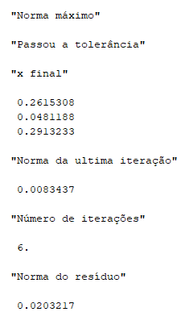

Resultado da implementação resolvendo com a eliminação:

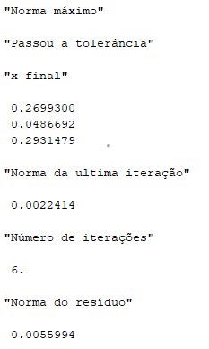

### Comentários

Podemos perceber que o método de Gauss-Seidel resolveu a o sistema com menos passos e, pelo menos quando resolvemos o sistema com L, obtemos um resíduo menor no fim das iterações. Ou seja, a terceira implementação precisou de menos passos e chegou mais perto do que seria o resultado.


## Questão 3

Resultados das implementações com a matriz sem fazer a troca de linhas:

<p align="middle">
  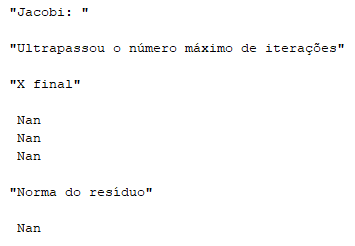
  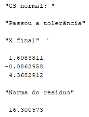 
  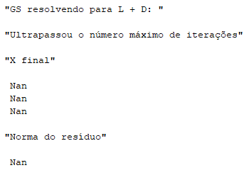
</p>

E fazendo a troca de linhas:

<p align="middle">
  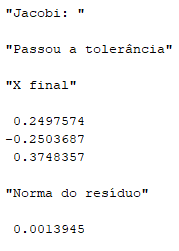
  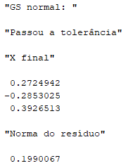 
  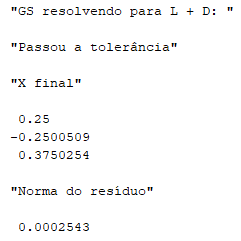
</p>

### Comentários
Podemos ver que com a primeira matriz (que não tem raio espectral menor que 1 nem diagonal estritamente dominante) nenhum dos métodos chegou a uma resposta satisfatória. O algorítmo que calcula com o método de Gauss-Seidel usando a função ```inv``` convergiu para um resultado, mas que não é próximo da solução de fato, visto que a norma do resíduo é um valor bem grande. Isto provavelmente se deve ao fato de que a matriz tem uma diagonal estritamente dominante mas está "desorganizada".

Quando permutamos as linhas da matriz (transformando-a numa matriz com diagonal estritamente dominante, cujas iterações convergem), todos os métodos deram aproximações parecidas.

## Questão 4
- a)
  
Código executado

```scilab
...
D_inv = inv(D)
M_j = (-D_inv)*(L+U)
disp("raio espectral")
disp(max(abs(spec(M_j))))
c_j = D_inv*b
...

A = [2 -1 1;
	 2 2 2;
	 -1 -1 2
]
b = [-1; 4; -5]

x_0 = [0; 0; 0]
E = 0.001
M = 26
norm_type = 2

[aprox, final_it, k, norm_res] = Jacobi_Method(A, b, x_0, E, M)

disp("Aproximação")
disp(aprox)

disp("Norma do resíduo")
disp(norm_res)
```

Resultados da implementação do método de jacobi para o sistema dado com 26 iterações:

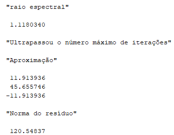

## 

- b)

Código executado

```scilab
...
disp("Autovalores")
disp(spec(A))
// parece ser

b = [-1; 4; -5]
x_0 = [0; 0; 0]
E = 0.00001
M = 100000
norm_type = %inf

[aprox, final_it, k, norm_res] = GS_Method(A, b, x_0, E, M)

disp("Aproximação")
disp(aprox)

disp("Norma do resíduo")
disp(norm_res)

disp("Iterações")
disp(k)
```

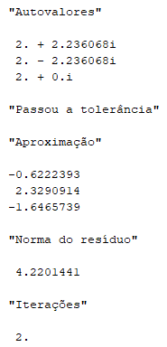

### Comentários
Podemos ver claramente que no item a) o vetor não convergiu para uma solução com 26 iterações, ou seja, o método de Jacobi falhou em dar uma aproximação. E isso se deve ao fato de que o raio espectral da matriz de iteração é maior do que 1 (como é mostrado na imagem).

Já no item b), com o método de Gauss-Seidel, foi possível chegar em uma aproximação com apenas 2 iterações. Isso acontece porque a matriz do método de Gauss-Seidel converge, diferente da matriz do método de Jacobi.

## Questão 5

- a)

Código executado

```scilab
...
A = [1 0 -1;
 -1*(1/2) 1 -1*(1/4);
  1 -1*(1/2) 1
]

disp("Autovalores")
disp(spec(A))

b = [(1/5); -1*(1425/1000); 2]
x_0 = [0; 0; 0]
E = 0.01
M = 300
norm_type = 2

[aprox, final_it, k, norm_res] = GS_Method(A, b, x_0, E, M)

disp("Aproximação")
disp(aprox)

disp("Norma do resíduo")
disp(norm_res)

disp("Iterações")
disp(k)
```

Resultados:

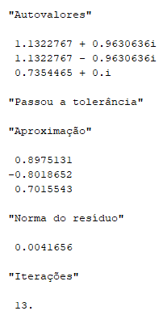

## 

- b)

Código executado

```scilab
...
A = [1 0 -2;
 -1*(1/2) 1 -1*(1/4);
  1 -1*(1/2) 1
]

disp("A")
disp(A)

b = [(1/5); -1*(1425/1000); 2]
x_0 = [0; 0; 0]
E = 0.01
M = 300
norm_type = 2

[aprox, final_it, k, norm_res] = GS_Method(A, b, x_0, E, M)

disp("Aproximação")
disp(aprox)

disp("Norma do resíduo")
disp(norm_res)

disp("Iterações")
disp(k)
```

Resultados: 

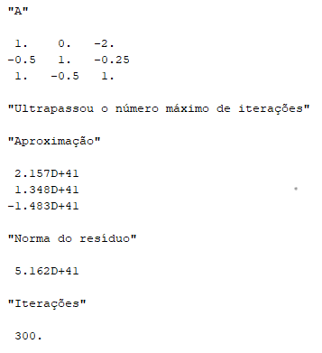

### Comentários

Como mostrado pelas imagens. O cálculo com a matriz converge para uma aproximação, enquanto com a segunda, ligeiramente diferente, não. A pequena mudança no último elemento da primeira linha da matriz já foi suficiente para que ela não convergisse.

## Questão 6

Código executado.

```scilab
...
function [A, b, x_0] = gerar_matrizes(n)
    A = rand(n, n);
    x = rand(n, 1);
    x_0 = zeros(n, 1);

    for i = 1:n
        for j = 1:n
            A(i, i) = A(i,i) + A(i, j) + A(j, i)
        end
    end

    b = A*x
endfunction

tolerance = 0.001
max_it = 1000
norm_type = 2

n = 10
[A, b, x_0] = gerar_matrizes(n)

disp("========================================================")
disp("n = ", n)
tic()
GS_Method_Std(A, b, x_0, tolerance, max_it, norm_type)
t = toc()
disp("Tempo GS normal")
disp(t)

tic()
GS_Method_Solve(A, b, x_0, tolerance, max_it, norm_type)
t = toc()
disp("Tempo GS com eliminação")
disp(t)


n = 100
[A, b, x_0] = gerar_matrizes(n)

disp("========================================================")
disp("n = ", n)
tic()
GS_Method_Std(A, b, x_0, tolerance, max_it, norm_type)
t = toc()
disp("Tempo GS normal")
disp(t)

tic()
GS_Method_Solve(A, b, x_0, tolerance, max_it, norm_type)
t = toc()
disp("Tempo GS com eliminação")
disp(t)

n = 1000
[A, b, x_0] = gerar_matrizes(n)

disp("========================================================")
disp("n = ", n)
tic()
GS_Method_Std(A, b, x_0, tolerance, max_it, norm_type)
t = toc()
disp("Tempo GS normal")
disp(t)

tic()
GS_Method_Solve(A, b, x_0, tolerance, max_it, norm_type)
t = toc()
disp("Tempo GS com eliminação")
disp(t)

n = 3000
[A, b, x_0] = gerar_matrizes(n)

disp("========================================================")
disp("n = ", n)
tic()
GS_Method_Std(A, b, x_0, tolerance, max_it, norm_type)
t = toc()
disp("Tempo GS normal")
disp(t)


tic()
GS_Method_Solve(A, b, x_0, tolerance, max_it, norm_type)
t = toc()
disp("Tempo GS com eliminação")
disp(t)
```

Resultados:

<p align="middle">
  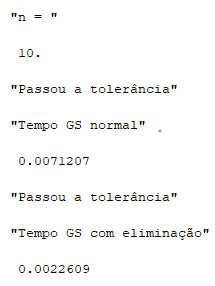
  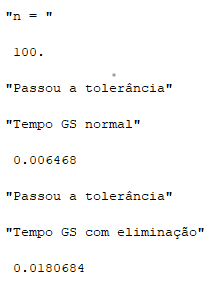 
  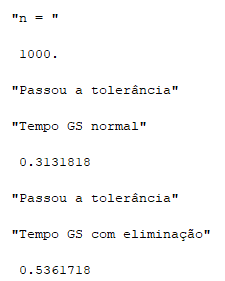
  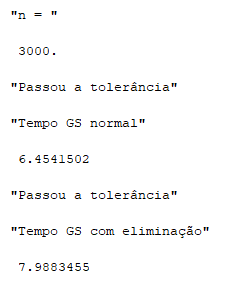
</p>

### Comentários

Por algum motivo, diferentemente do que seria de se esperar, em todos os valores de $n$ o método de calcular usando a matriz inversa se mostrou mais rápido do que o método resolvendo para L + D. Talvez isso se deva a um problema de hardware, uma vez que minha máquina demorou bastante para iniciar a execução do código. Novamente, não consegui encontrar no meu código onde eu possa estar errando, e gostaria de um feedback quanto a isso.