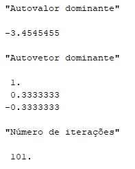
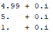

# ALN - Aula Prática 3
Autor: Daniel de Miranda Almeida

Matrícula: 241708065, Curso: Ciência de Dados

# Questão 1

```scilab
function [x] = Ajusta_vetor(x)
	// Retorna o vetor ajustado, dividindo-o pelo seu elemento da maior
	// valor absoluto.

	[max_value, max_index] = max(abs(x))
	if x(max_index) < 0 then
		max_value = -max_value
	end
	x = x/max_value
endfunction
****
function [lambda, x1, k, n_erro] = Metodo_potencia_v1(A, x0, epsilon, M)
	// Calcula o autovalor dominante da matriz de maneira iterativa usando o método
	// da potência.

	// Inicializando contador de iterações.
	k=0
	
	// Dividindo vetor pela valor da coordenada de maior módulo para que essa
	//seja igual a 1.
	max_value = max(abs(x0))

	x0 = x0/max_value
	// Codigo adicionado pra corrigir erro.
	
	// Primeira iteração.
	x1 = A*x0
	
	// Iniciando erro maior que epsilon para que o codigo entre no loop.
	n_erro = epsilon + 1 // Obriga a entrar no loop

	while k<=M && n_erro >= epsilon then
		// A aproximação do autovalor é o elemento de maior valor absoluto
		// do vetor.
		lambda = max(abs(x1))
		
		// Redução de escala.
		x1 = x1/lambda

		// Erro da iteração atual.
		n_erro = norm((x1 - x0), %inf)
		
		// Indo para a próximo iteração
		x0 = x1
		x1 = A*x0
		k = k+1
	end
endfunction
```

Nessa função estamos, a cada iteração, divindo o vetor pela coordenada de maior valor, de forma a manter essa coordenada sempre igual a 1 e em seguida fazendo a iteração multiplicando x0 por A. É necessário sempre fazer uma redução na escala do vetor para evitar que ele tome valores cada vez maiores que possam causar erros de arredondamento. A cada iteração pegamos o lambda, que é o elemento com maior valor absoluto do vetor e novamente dividimos o vetor por esse valor. Obtemos o erro da iteração calculando a norma infinito da diferença do vetor da iteração atual pelo vetor da iteração anterior. Isso se repete até que o erro esteja abaixo de uma tolerância ou tenhamos ultrapassado o número limite de iterações. Conforme fazemos as iterações, o elemento com maior valor absoluto do vetor se aproxima do autovalor dominante da matriz.

```scilab
function [lambda, x1, k, n_erro] = Metodo_potencia_v2(A, x0, epsilon, M)
	// Encontra o autovalor dominante da matriz pelo método da potência, utilizando
	// o Quociente de Rayleigh.

	// Inicializando contador de iterações.
	k = 0

	// Redução de escala.
	x0 = x0/norm(x0, 2)

	// Primeira iteração.
	x1 = A*x0

	// Inicializando erro.
	n_erro = epsilon+1

	while k<=M && n_erro >= epsilon then
		// Aproximando lambda com o quociente de Rayleigh.
		lambda = x1'*x0
		
		// Ajuste do vetor.
		if lambda<0 then
			x1 = -x1
		end

		// Redução de escala.
		x1 = x1/norm(x1, 2)

		// Erro da iteração atual.
		n_erro = norm((x1-x0), 2)

		// Indo para a próxima iteração.
		x0 = x1
		x1 = A*x0
		k = k+1
	end

endfunction
```

Aqui a diferença é que estamos fazendo a redução da escala do vetor normalizando-o. Além disso, estamos obtendo aproximações do autovalor de A utilizando o quociente de Rayleigh.

# Questão 2

```scilab
function [x] = Resolve_sistema_4(A, b)
    // Resolve sistema usando a elimincação de Gauss-Seidel com trocas de
    // linha utilizando o pivô de maior módulo.

    [C, P] = Gaussian_Elimination_4(A)
    [x] = Resolve_com_LU_4(C, b, P)
endfunction

function [lambda, x1, k, n_erro] = Potencia_deslocada_inversa(A, x0, epsilon, alfa, M)
	// Encontra o autovalor da matriz A mais próximo do alfa dado pelo método da
	// potência inversa deslocada.

	// Inicializando contador.
    k = 0
    
    // Inicializando erro.
	n_erro = epsilon + 1
	
    // Normalizando o vetor inicial.
    x0 = x0/norm(x0, 2)
    
	// Criando matriz de deslocamento.
    [n] = size(A, 1)
	I = eye(n, n)
	A_deslocada = A - alfa*I

	while k<=M && n_erro >= epsilon then
        // Resolvendo sistema para encontrar próxima iteração.
        [x1] = Resolve_sistema_4((A_deslocada), x0)
		
        // Normalizando vetor.
        x1 = x1/norm(x1, 2)
		
        // Aproximando lambda.
        lambda = x1' * A * x1
		if (x1'*x0 < 0) then
			x1 = -x1
		end

        // Calculando erro da última iteração.
		n_erro = norm(x1 - x0, 2)

        // Indo para próxima iteração.
		x0 = x1
		k = k+1
	end
endfunction
```

Nessa função fazemos o deslocamento da matriz A subtraindo dela uma matriz identidade multiplicada por $\alpha$. Isso faz com que o método convirja para o autovalor mais próximo de $\alpha$. Além disso, com o uso da potência inversa temos que o método converge para o autovalor mais rapidamente. Nessa função, a aproximação do lambda é feita usando o quociente de Rayleigh da mesma forma que na versão 2 do método da potência.

# Questão 3

O primeiro teste é com uma matriz bem simples:

```scilab
A = [1 1;
	 2 0]

x0 = [1; 0]

[lambda, x1, k, n_erro] = Metodo_potencia_v1(A, x0, 0.001, 100)

disp("Autovalor dominante")
disp(lambda)
disp("Autovetor dominante")
disp(Ajusta_vetor(x1))
disp("Número de iterações")
disp(k)
disp("Erro da última iteração")
disp(n_erro)

[lambda, x1, k, n_erro] = Metodo_potencia_v2(A, x0, 0.001, 100)

disp("Autovalor dominante")
disp(lambda)
disp("Autovetor dominante")
disp(Ajusta_vetor(x1))
disp("Número de iterações")
disp(k)
disp("Erro da última iteração")
disp(n_erro)

disp("Autovalores pelo scilab")
disp(spec(A))
```
Resultados: 

<p align="middle">
  
   
</p>


### Comentários

O primeiro método parece ter mais precisão na sua aproximação do autovalor dominante da matriz; em contrapartida, o segundo método gastou menos iterações para chegar em um resultado semelhante.

#

O segundo teste é com uma matriz mais complexa, e testando para vários valores de epsilon.

```scilab
A = [1 2 3 4;
	 2 1 4 10;
	 3 4 1 -7;
	 5 4 5 1]

x0 = [1; 0; 0; 0]

for i=1:1:5
	disp("===================================")
	
	epsilon = 1/(10**i)
	disp("epsilon:")
	disp(epsilon)

	[lambda, x1, k, n_erro] = Metodo_potencia_v1(A, x0, epsilon, 100)
	
	disp("Aproximação do autovalor")
	disp(lambda)
	disp("Autovetor dominante")
	disp(x1/max(x1))
	disp("Número de iterações")
	disp(k)
end

for i=1:1:5
	disp("===================================")
	
	epsilon = 1/(10**i)
	disp("epsilon:")
	disp(epsilon)

	[lambda, x1, k, n_erro] = Metodo_potencia_v2(A, x0, epsilon, 100)
	
	disp("Aproximação do autovalor")
	disp(lambda)
	disp("Autovetor dominante")
	disp(x1/max(x1))
	disp("Número de iterações")
	disp(k)
end

disp("Autvalor dominante da matriz")
autovalores = spec(A)
[dom, idx] = max(abs(autovalores))
if autovalores(idx) < 0 then
	dom = -dom
end
disp(dom)
```

<p align="middle">
  
  
  
  
  
</p>

<p align="middle">
  
  
  
  
  
</p>


### Comentários

Novamente podemos ver a relação entre precisão e número de iterações entre as duas versões do algorítmo. Agora, variando a tolerância para o erro da aproximação, podemos ver que conforme colocamos uma tolerância menor, nos aproximamos cada vez mais do valor real do autovalor, mas também gastando cada vez mais iterações para tal, como era de se esperar.

#

O último teste é com uma matriz que tem como autovalor dominante um número negativo.

```scilab

A = [-2.5 3.5 -2.5;
	 -1 2 1;
	 -3.5 3.5 -1.5]

x0 = [1; 0; 0]

disp("Autovalores da matriz A")
disp(spec(A))
```


Quando tentamos aproximar o autovalor dominante dessa matriz com os métodos: 

``` scilab
[lambda, x1, k, n_erro] = Metodo_potencia_v1(A, x0, 0.001, 100)

disp("Autovalor dominante")
disp(lambda)
disp("Autovetor dominante")
disp(Ajusta_vetor(x1))
disp("Número de iterações")
disp(k)
disp("Erro da última iteração")
disp(n_erro)
disp("Autovalores pelo scilab")
disp(spec(A))

[lambda, x1, k, n_erro] = Metodo_potencia_v2(A, x0, 0.001, 100)

disp("Autovalor dominante")
disp(lambda)
disp("Autovetor dominante")
disp(Ajusta_vetor(x1))
disp("Número de iterações")
disp(k)
disp("Erro da última iteração")
disp(n_erro)
disp("Autovalores pelo scilab")
disp(spec(A))
```

<p align="middle">
  
  
</p>

Podemos ver que o método não converge para a versão 1 do algorítmo, e, portanto, não chega a uma aproximação do autovalor dominante da matriz A. Isso acontece porque quando obtemos o elemento do valor com maior valor absoluto não estamos tomando o cuidado de manter o sinal dele, estamos pegando seu valor absoluto sempre. Podemos corrigir o código da seguinte maneira (as linhas com "//" ao final são as linhas adicionadas): 

```scilab
function [lambda, x1, k, n_erro] = Metodo_potencia_v1(A, x0, epsilon, M)
	// Calcula o autovalor dominante da matriz de maneira iterativa usando o método
	// da potência.

	// Inicializando contador de iterações.
	k=0
	
	// Dividindo vetor pela valor da coordenada de maior módulo para que essa
	//seja igual a 1.
	[max_value, max_index] = max(abs(x0))
	if x0(max_index) < 0 then //
		lambda = -lambda //
	end //

	x0 = x0/max_value
	// Codigo adicionado pra corrigir erro.
	
	// Primeira iteração.
	x1 = A*x0
	
	// Iniciando erro maior que epsilon para que o codigo entre no loop.
	n_erro = epsilon + 1 // Obriga a entrar no loop

	while k<=M && n_erro >= epsilon then
		// A aproximação do autovalor é o elemento de maior valor absoluto
		// do vetor.

		// Apesar de precisarmos do elemento com maior valor absoluto
		// a operação não deve ser feita com o valor absoluto.
		[lambda, max_index] = max(abs(x1)) //
		if x1(max_index) < 0 then //
			lambda = -lambda //
		end //

		// Redução de escala.
		x1 = x1/lambda

		// Erro da iteração atual.
		n_erro = norm((x1 - x0), %inf)
		
		// Indo para a próximo iteração
		x0 = x1
		x1 = A*x0
		k = k+1
	end
endfunction
```

Agora, rodando novamente:

``` scilab
[lambda, x1, k, n_erro] = Metodo_potencia_v1(A, x0, 0.001, 100)

disp("Autovalor dominante")
disp(lambda)
disp("Autovetor dominante")
disp(Ajusta_vetor(x1))
disp("Número de iterações")
disp(k)
disp("Erro da última iteração")
disp(n_erro)
```


# Questão 4
O primeiro teste foi feite com a seguinte matriz: 

```scilab
A = [-2.5 3.5 -2.5;
     -1 2 1;
     -3.5 3.5 -1.5]
//

AtA = A'*A
```

Para encontrar os autovalores eu utilizei o método da potência inversa deslocada colocando como alfa os centros dos discos (os elementos da diagonal de A), uma vez que estes são as melhores aproximações para os autovalores da matriz - os autovalores são todos reais e, como o disco define um intervalo onde o autovalor possa estar, a melhor estimativa é o centro desse intervalo. Contudo, se houver uma sobreposição dos discos, pode ocorrer uma situação em que utilizar o centro de dois discos diferentes acaba fazendo o método convergir para o mesmo valor:

```scilab
// Centros dos discos.
centros = diag(AtA)
disp("Centros dos discos: ")
disp(centros)

autovalores = zeros(n)

for i=1:n
	[lambda1, x1, k, n_erro] = Potencia_deslocada_inversa(AtA, x0, 0.001, centros(i), 100)
	
	autovalores(i) = lambda1
end

disp("Autovalores encontrados: ")
disp(autovalores)

disp("Autovalores dados pelo scilab: ")
disp(spec(AtA))
```


Nesses resultados podemos ver que dois dos centros (19.5 e 9.5) convergiram para o autovalor 3.75, enquanto o centro 28.5 convergiu para o autovalor 51.68. Para que o método seja capaz de encontrar todos os autovalores de uma matriz precisamos que seus discos sejam disjuntos. Podemos ter uma matriz com discos disjuntos se tivermos seus centros bastante distantes entre si com raios não muito grandes. Um exemplo de matriz com discos disjuntos seria: 

```scilab
A = [10 1 1/2;
     1 20 2;
     1/2 2 30]
```

Calculando a aproximação dos autovalores dessa matriz: 

```scilab
centros = diag(A)
disp("Centros dos discos: ")
disp(centros)

autovalores = zeros(n)

for i=1:n
	[lambda1, x1, k, n_erro] = Potencia_deslocada_inversa(A, x0, 0.001, centros(i), 100)
	
	autovalores(i) = lambda1
end

disp("Autovalores encontrados: ")
disp(autovalores)

disp("Autovalores dados pelo scilab: ")
disp(spec(A))
```


E aqui conseguimos uma aproximação de todos os autovalores.

# Questão 5

Minha primeira ideia foi criar uma matriz que tem como autovalores dominantes dois valor que são um o negativo do outro.

```scilab
A = [-2 -3 -3;
	 -4 -2 -4;
	 4 3 5]
//

[R, diagvalues] = spec(A)
```

Autovalores


Autovetores


Tentando calcular uma aproximação para o autovalor dominante usando as duas versões do método da potência:

```scilab
x0 = [0; 1; 1]

[lambda, x1, k, n_erro] = Metodo_potencia_v1(A, x0, 0.001, 100)

disp("Autovalor dominante")
disp(lambda)
disp("Autovetor dominante")
disp(Ajusta_vetor(x1))
disp("Número de iterações")
disp(k)

[lambda, x1, k, n_erro] = Metodo_potencia_v2(A, x0, 0.001, 100)

disp("Autovalor dominante")
disp(lambda)
disp("Autovetor dominante")
disp(Ajusta_vetor(x1))
disp("Número de iterações")
disp(k)
```

<p align="middle">
  
  
</p>

Se colocarmos o autovetor inical como ```x0 = [1; 0; 0]```: 

<p align="middle">
  
  
</p>

E para ```x0 = [1; 1; 1]```: 

<p align="middle">
  
  
</p>

Podemos ver que nenhum dos dois algorítmos consegue chegar em uma aproximação, porque a matriz não tem um autovalor dominante para o qual o método possa convergir. Mudar os vetores iniciais claramente muda o resultado final, e em um dos casos o algoritmo inclusive se aproximou de fato de um dos autovalores "dominantes".

# 

O outro teste que fiz foi ver como o algoritmo se comportava com uma matriz que tivesse um autovalor muito próximo do autovalor dominante.

```scilab
A = [499/100 399/100 399/100;
	 -1/100 499/100 -1/100;
	 1/100 -399/100 101/100]
```

Autovalores


Autovetores


Usando os dois algoritmos com ```x0 = [1; 0; 0]```:

<p align="middle">
  
  
</p>

Com ```x0 = [0; 1; 1]```:

<p align="middle">
  
  
</p>


Com ```x0 = [1; 1; 1]```:

<p align="middle">
  
  
</p>

Podemos ver que o primeiro método nunca converge de fato e nós três testes retorna a aproximação que não é do autovalor dominante da matriz. A segunda versão do método retornou aproximações que ficam mais próximas do menor autovalor entre os dois maiores. Além disso, se observamos a aproximação do autovetor retornado vemos que ele se parece com uma mistura dos dois autovetores relacionados aos maiores autovalores da matriz.