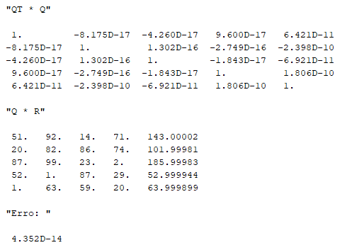
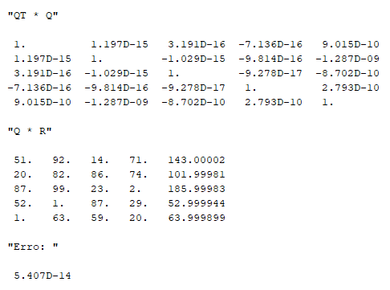

# ALN - Aula Prática 3
Autor: Daniel de Miranda Almeida

Matrícula: 241708065, Curso: Ciência de Dados

# Questão 1
Matrizes utilizadas nas questões 1 a 4:

  
   

Resultados de qr_GS:

  
   

# Questão 2
Resultados de qr_GSM:

  
   

# Questão 3
Resultados de qr_GSP:

  
   

# Questão 4
## Questão 4.1
Resultados de qr_House_v1:

  
   

Resultados de qr_House_v2:

  
   

## Questão 4.2
Matrizes:

  
   
   

Resultados de qr_GS:

  
   
   

Resultados de qr_GSM:

  
   
   

Resultados de qr_GSP:

  
   
   

Resultados de qr_House_v1:

  
   
   

Resultados de qr_House_v2:

  
   
   

