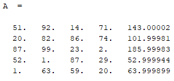
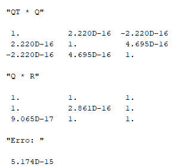

# ALN - Aula Prática 3
Autor: Daniel de Miranda Almeida

Matrícula: 241708065, Curso: Ciência de Dados

# Questão 1
Código da função da questão 1:

```scilab
function [q, r_vetor] = Project_into(Q, a)
    // Projeto um vetor no espaço definido pelos vetores dados.
    // q é o vetor no qual estamos projetando a.
    // Retorna a projeção e a coluna de r definida por ela.

    // Número de colunas.
    cols = size(Q, 'c')
    r_vetor = 0

    // Iniciando operação que vai definir v.
    v = a
    for i = 1:cols
        q = Q(:, i)
        coeficiente_projecao = q' * a
        projecao = coeficiente_projecao * q
        if i==1 then
            r_vetor = coeficiente_projecao
        else
            // Adicionando coeficiente na matriz de coeficientes.
            r_vetor = [r_vetor; coeficiente_projecao]
        end

        // Subtraindo a projeção para encontrar o perpendicular.
        v = v - projecao
    end

    v_norm = norm(v, 2)

    // Normalizando vetor.
    q = v/v_norm
    r_vetor = [r_vetor; v_norm]

endfunction

function [Q, R] = qr_GS(A)
    // Calcula a decomposição QR da matriz A.
    
    n = size(A, 'r');

    // Primeiro vetor é a primeira coluna de A.
    v_current = A(:, 1)
    // Normalizando.
    v_norm = norm(v_current, 2)
    q_current = v_current/v_norm
    r_current = [v_norm; zeros(n - 1, 1)]

    Q = q_current
    R = [r_current]

    for i = 2:n
        // Os outros vetores são a projeção da próxima coluna de A no espaço
        // formado.

        // Calculando proxima projeção.
        [q_current, r_vetor] = Project_into(Q, A(:, i))

        // Atualizando variáveis
        Q = [Q q_current]
        // Adicionando zeros em r_vetor caso seja necessário.
        r_vetor = [r_vetor; zeros(n-i,1)]
        R = [R r_vetor]
    end
endfunction

function [error] = Compute_accuracy_QR(Q, R, A)
    // Compute how close to the initial A matrix QR is.

    QR = Q * R
    error = A - QR
    error = sum(abs(error))
endfunction
```
Eu optei por fazer uma função auxiliar para fazer a projeção do vetor A no espaço definido pelos q's de iterações anteriores para deixar o código mais limpo.

A última função ```Compute_accuracy_QR``` é uma função que tem como objetivo calcular quão bem a matriz QR aproxima A. Na função é feita a subtração de QR de A e calculada a soma dos valores absolutos de toda a matriz resultante. Essa função será a mesma sempre que aparecer, com a exceção da questão 3, onde precisamos também permutar a matriz QR usando a matriz P criada.

Matrizes utilizadas nas questões 1 a 4:

<p align="middle">
  
   
</p>

Resultados de qr_GS:
<p align="middle">
  
   
</p>

A segunda matriz A foi criada com python (linguagem que tenho mais familiaridade) para ser uma matriz quase linearmente dependente da seguinte maneira:
- Foi criada uma matriz 5x5 com inteiros aleatórios entre 1 e 100.
- A última coluna da matriz foi colocada como a soma das duas primeiras.
- E por fim foi adicionando um pequeno ruído Gaussiano (com média 0 e desvio de $1^{-4}$) de forma que a última coluna fosse ligeiramente diferente da soma das duas primeiras.

# Questão 2

Código da questão 2:

```scilab
function [Q, R] = qr_GSM(A)
	// Outra forma de calcular a decomposição QR da matriz A.

	// Pegando número de linhas de A.
	n = size(A, 'r')

	for j = 1:n
		// Vetor atual é a j-esima coluna de A.
		v = A(:, j)
		
		// A partir da segunda iteração:
		for i = 1:j-1
			// Fazendo projeções de v no espaço dos q's já criados.
			q_i = Q(:, i)
			// Coeficiente.
			r_ij = q_i' * v
			R(i, j) = r_ij
			// Pegando perpendicular da projeção.
			v = v - r_ij * q_i
		end

		v_norm = norm(v, 2)
		// Normalizando v;
		Q(:, j) = v/v_norm
		R(j, j) = v_norm
	end
endfunction
```

Resultados de qr_GSM:
<p align="middle">
  
   
</p>

# Questão 3

Código da questão 3:

```scilab
function [P] = Create_perm_col(size_m, col_1, col_2)
    //create identity matrix
    I = eye(size_m, size_m)
    // permutate its lines
    I(:, [col_1, col_2]) = I(:, [col_2, col_1])
    P = I
endfunction

// Decomposição QR com pivoteamento de colunas.
function [Q, R, P] = qr_GSP(A)
    // Calcula a decomposição QR da matriz A usando pivoteamento de colunas.
    
    // Tamanho de A.
    n = size(A, 'r')

    // Inicializando Q e R.
    Q = zeros(n, n)
    R = zeros(n, n)

	// Inicializando matriz que vai armazenar as permutações.
	P = eye(n, n)

    for j = 1:n
        // Fazendo pivoteamento.
		// Calculando normas.
		normas = zeros(1, n)
		for i = 1:n
			normas(i) = norm(A(:,i))
		end
		// Obtendo maior coluna e seu índice.
		[_, coluna_indice] = max(normas);
        coluna_indice = coluna_indice + j - 1
		// Criando permutação.
        [Perm] = Create_perm_col(n, j, coluna_indice)
		// Permutando A.
		A = A * Perm
		// Armezando permutação.
		P = P * Perm

		a_j = A(:, j)
        // Vetor v começa como a.
        v = a_j
        for i = 1:j-1			
			// Pegando q's anteriores.
            q_i = Q(:, i)
            
            // Calculando coeficientes.
            r_ij = q_i' * a_j
            R(i, j) = r_ij

            // Calculando projeção de a no espaço.
            v = v - r_ij * q_i
        end
        v_norm = norm(v)
        R(j, j) = v_norm
        
        // Normalizando v.
        Q(:,j) = v/v_norm
    end
endfunction
```

A função ```Create_perm_col``` é uma função auxiliar que cria uma matriz de permutação de colunas a partir da permutação desejada para as colunas da matriz A.

Resultados de qr_GSP:
<p align="middle">
  
   
</p>

# Questão 4
## Questão 4.1

Código da questão 4.1:

```scilab

function [U, R] = qr_House_v1(A)
    // Decompõe matriz A em U e R usando refletores de Househoulder.
    
    // Pegando dimensões de A.
    [m, n] = size(A)
    R = A
    U = zeros(m, n)

    for j = 1:n
        x = R(j:m, j)
        x_size = size(x, 'r')
		
		// Criando vetor u.
		alpha = norm(x)
		if x(1) >=0 then
			alpha = -alpha
		end
		e_1 = [1; zeros(x_size - 1, 1)]
		u = x - alpha * e_1
        u_norm = norm(u)

        // Evitando Nan.
        if u_norm > 0 then
            // Normalizando U.
            u = u/u_norm
            // Aplicando reflexão.
            R(j:m, j:n) = R(j:m, j:n) - 2 * u * (u' * R(j:m, j:n))
            U(j:m, j) = u
        end
    end
endfunction

function [U, R] = qr_House_v2(A)
	// Decompõe matriz A em U e R usando refletores de Househoulder.

	// Pegando dimensões de A.
	[m, n] = size(A)
	k = min(m - 1, n)

	// Inicializando matrizes U e R.
	U = zeros(m, k)
	R = A

	for j = 1:k
		// Selecionando coluna atual de A (R).
		x = R(j:m, j)
		x_size = size(x, 'r')
		
		// Criando vetor u.
		alpha = norm(x)
		if x(1) >=0 then
			alpha = -alpha
		end
		e_1 = [1; zeros(x_size - 1, 1)]
		u = x - alpha * e_1
		u = u/norm(u)
		// Adicionando vetor u à matriz U.
		U(j:m, j) = u

		// Aplicando reflexão.
		R(j:m, j:n) = R(j:m, j:n) - 2 * u * (u' * R(j:m, j:n))
		
		// R = H * R
	end

endfunction

function [Q] = Constroi_Q_House(U)
	// Cria matriz ortogonal Q a partir da matriz U.

	[m, n] = size(U)
	k = min(m, n)
	Q = eye(m, m)
	for j = n:-1:1
		u = U(j:m, j)
		u_size = size(u, 'r')

		// Aplicando reflexão.
		Q(j:m, :) = Q(j:m, :) - 2 * u * (u' * Q(j:m, :))
	end
endfunction
```

Resultados de qr_House_v1:
<p align="middle">
  
   
</p>
Resultados de qr_House_v2:
<p align="middle">
  
   
</p>

### Comentários sobre as questões 1 a 4.1
Como podemos ver, principalmente com a segunda matriz, que traz mais problemas para algorítmos menos estáveis numericamente (devido à sua última coluna que é quase igual a soma de duas outras), o erro foi mudando conforme avançamos pelos algorítmos, desde o mais simples e menos estável que é o método de Gram Schmidt até o mais complexo e mais estável método utilizando refletores de Househoulder. 

Por algum motivo o erro na realidade aumentou conforme avançamos pelos algorítmos, mas imagino que seja algum erro meu na função que calcula esse erro, de qualquer forma, podemos ver que há uma diferença sensível no erro para o primeiro método em relação ao último, diferença essa que deve aumentar quando escalarmos para matrizes maiores e mais instáveis (entenda instável como matriz que gera mais erro para algortímos menos estáveis numericamente).

## Questão 4.2
Matrizes:
<p align="middle">
  
   
   
</p>

Resultados de qr_GS:
<p align="middle">
  
   
   
</p>
Resultados de qr_GSM:
<p align="middle">
  
   
   
</p>
Resultados de qr_GSP:
<p align="middle">
  
   
   
</p>
Resultados de qr_House_v1:
<p align="middle">
  
   
   
</p>
Resultados de qr_House_v2:
<p align="middle">
  
   
   
</p>

Para essas últimas matrizes, os métodos usando Refletores de Householder parecem ter gerado matrizes Q "melhores", pois podemos ver que as últimas multiplicações $Q^{T}Q$ parecem se aproximar mais da matriz identidade. Além disso os métodos usando refletores também parecem ter gerado erros ligeiramente menores para as matrizes em questão.